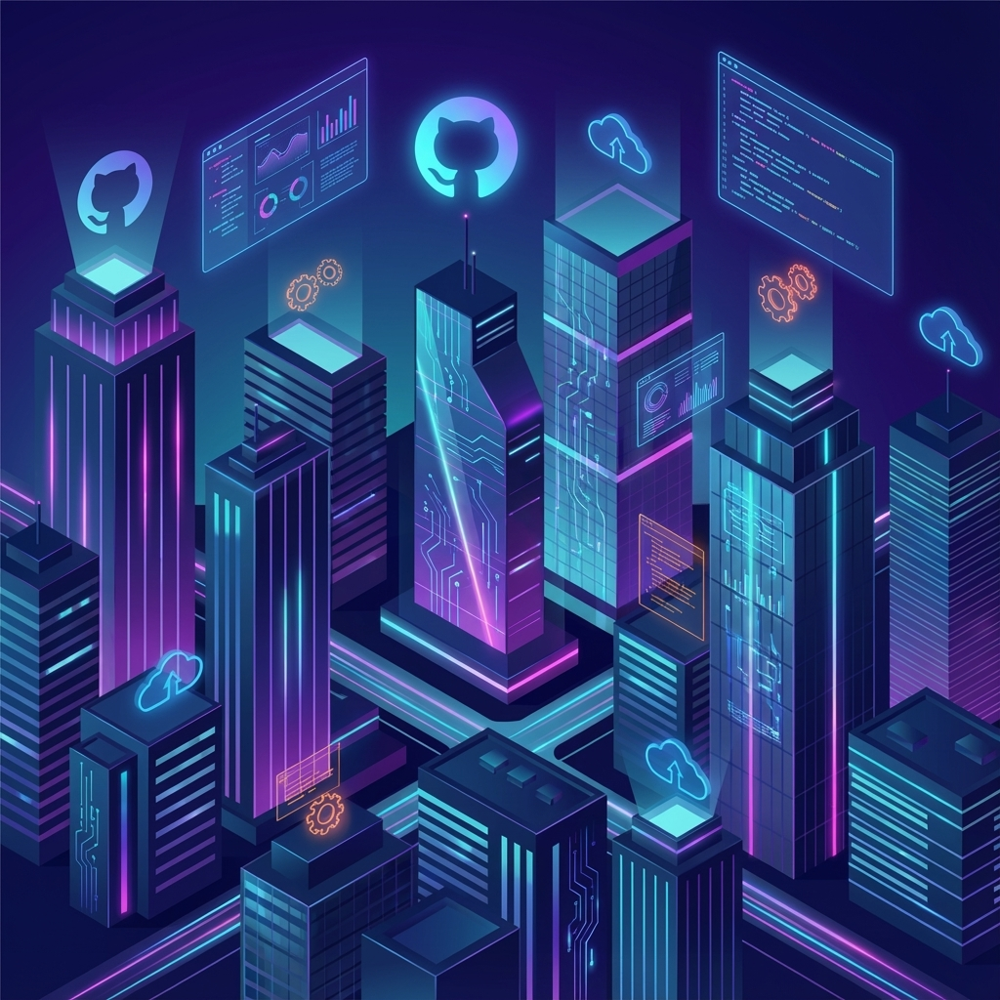

<p align="center">
  
</p>

<h1 align="center">
  
</h1>

<p align="center">
  <a href="https://github.com/abay20357">
    
  </a>
  <a href="achmadakbar046@gmail.com">
    
  </a>
  <a href="https://linkedin.com/in/yourprofile">
    
  </a>
</p>

<p align="center">
  
</p>

---

##  &nbsp;About Me

```javascript
const abay = {
    name: "Achmad Akbar",
    nickname: "Abay",
    role: "Frontend Developer & UI/UX Enthusiast",
    location: "Indonesia 🇮🇩",
    
    currentFocus: [
        "Building modern web applications",
        "Crafting beautiful user interfaces",
        "Learning new technologies"
    ],
    
    funFact: "I believe code makes it work, design makes it feel right ✨"
};
```

---

##  &nbsp;Tech Stack

<p align="center">
  
</p>

<details>
<summary><b>📊 More Details</b></summary>
<br/>

| Category | Technologies |
|----------|-------------|
| **Frontend** | HTML5, CSS3, JavaScript, React |
| **Styling** | Tailwind CSS, Responsive Design |
| **Design** | Figma, UI/UX Principles |
| **Tools** | Git, GitHub, VS Code |

</details>

---

##  &nbsp;GitHub Stats

<p align="center">
  
  
</p>

<!-- 3D Isometric Contribution Calendar - Displays directly! -->
<p align="center">
  
</p>

<!-- Additional 3D City Stats Cards -->
<p align="center">
  
  
</p>

---

##  &nbsp;What I'm Working On

<table align="center">
<tr>
<td width="50%">

### 🌐 Web Development
- Building responsive dashboards
- Creating modern UI components
- Learning React ecosystem

</td>
<td width="50%">

### 🎨 Design
- Crafting user-friendly interfaces
- Implementing design systems
- Exploring micro-animations

</td>
</tr>
</table>

---

##  &nbsp;Currently Learning

<p align="center">
  
  
  
</p>

---

<p align="center">
  
</p>

<p align="center">
  <i>"Code makes it work, design makes it feel right."</i>
</p>

<p align="center">
  <b>Thanks for visiting! ⭐</b>
</p>
