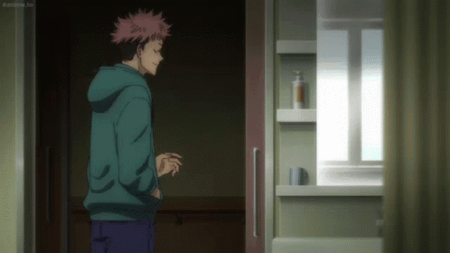

<p align="center">
  
</p>


<h1 align="center">
  
</h1>

<p align="center">
  <a href="https://github.com/abay20357">
    
  </a>
  <a href="mailto:achmadakbar046@gmail.com">
    
  </a>
  <a href="https://www.linkedin.com/in/achmad-akbar-546165308/">
    
  </a>
</p>

<p align="center">
  
</p>


##  &nbsp;About Me

```javascript
const abay = {
    name: "Achmad Akbar",
    nickname: "Abay",
    role: "Frontend Developer & UI/UX Enthusiast",
    location: "Indonesia 🇮🇩",
    
    currentFocus: [
        "Building modern web applications",
        "Crafting beautiful user interfaces",
        "Learning new technologies"
    ],
    
    funFact: "I believe code makes it work, design makes it feel right ✨"
};
```


##  &nbsp;Now Playing on Spotify

<p align="center">
  <a href="https://open.spotify.com/user/31qmlt2rvmca2iwet3i637x5dxky">
    
  </a>
</p>

<p align="center">
  <a href="https://open.spotify.com/user/31qmlt2rvmca2iwet3i637x5dxky">
    
  </a>
  &nbsp;
  <a href="https://open.spotify.com/user/31qmlt2rvmca2iwet3i637x5dxky/playlists">
    
  </a>
</p>


##  &nbsp;Tech Stack

### 💻 Languages
<p>
  
  
  
  
  
  
  
</p>

### ⚙️ Frameworks
<p>
  
  
  
  
</p>

### 📁 Database & Caching
<p>
  
  
  
</p>

### 💡 Tools
<p>
  
  
  
  
</p>

### 🎨 Design
<p>
  
  
  
</p>

### 🔮 These are current projects that I still develop and build

- LibreNMS Automation with Laravel
- Flutter LMS Application & API using Laravel
- UI Component Library / Template
- Making My Own Blog Using Next JS (also learn how to use it)


##  &nbsp;GitHub Stats

<p align="center">
  
  
</p>

<p align="center">
  
</p>

<p align="center">
  
</p>


##  &nbsp;What I'm Working On

<div align="center">

| 🌐 **Web Development** | 🎨 **Design** | 📱 **Mobile** |
|:----------------------:|:-------------:|:-------------:|
|  |  |  |
|  |  |  |
|  |  |  |

</div>

<br/>

<p align="center">
  
</p>

<p align="center">
  <code>🔥 POS System with Laravel + React</code>&nbsp;&nbsp;
  <code>📚 Learning Management System</code>&nbsp;&nbsp;
  <code>🎨 UI Component Library</code>
</p>


##  &nbsp;Currently Learning

<p align="center">
  
  
  
</p>

<p align="center">
  
</p>

<p align="center">
  <b>Thanks for visiting! ⭐</b>
  <br/>
  <sub>Let's connect and build something amazing together! 🚀</sub>
</p>

<p align="center">
  
</p>

<p align="center">
  
</p>
